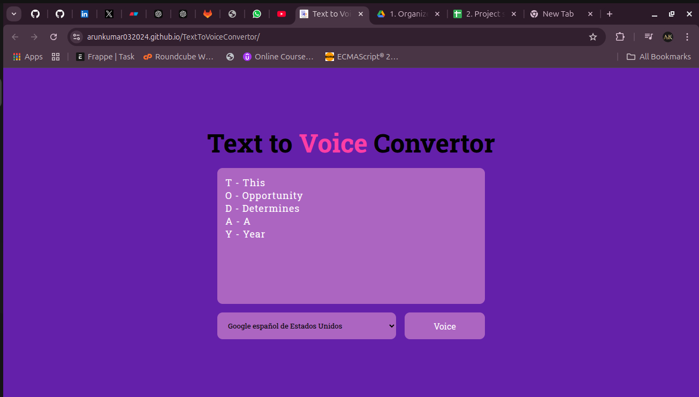

# Text to Voice Converter

A minimalist and easy-to-use web application that converts text into voice. Built using pure HTML, CSS, and JavaScript, this project demonstrates the use of browser-based text-to-speech technology.

## Features

- User-friendly interface with a visually appealing design.
- Converts any entered text into speech.
- Language and voice customization options.
- Lightweight and fast as it uses vanilla JavaScript.

## How It Works

1. Enter the text you want to convert into speech in the input box.
2. Select the desired language or voice from the dropdown menu.
3. Click the **Voice** button to listen to the text being spoken.

## Tech Stack

- **HTML**: Structure of the web application.
- **CSS**: Styling and layout for a visually engaging interface.
- **JavaScript**: Adds interactivity and handles the text-to-speech functionality using the Web Speech API.

## Try out it

[Click here to view the project live!](https://arunkumar032024.github.io/TextToVoiceConvertor/)

## Project Screenshot



## How to Run Locally

1. Clone the repository:
   ```bash
   git clone https://github.com/your-username/TextToVoiceConverter.git
